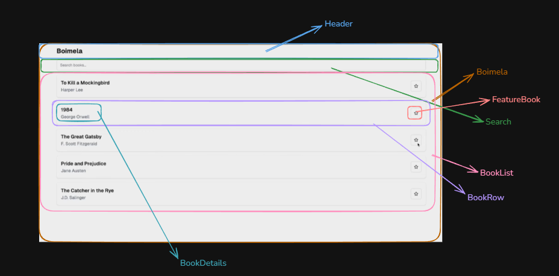
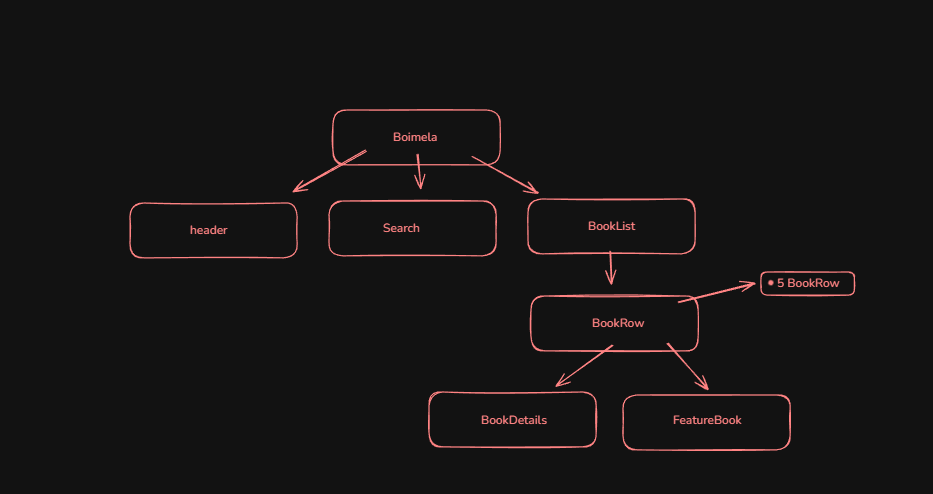

## Thinking in React

- How to think of Components.
- How to identify Sates.
- How to Decide The Data Flow.

<!-- Think React Component Data Flow images Screenshot -->

<h2>Component Hauraki Images</h2>

<h2>Component Stackers Images</h2>

